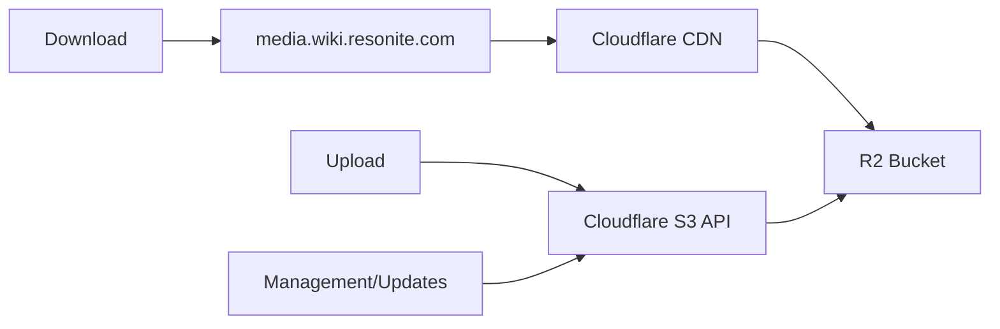
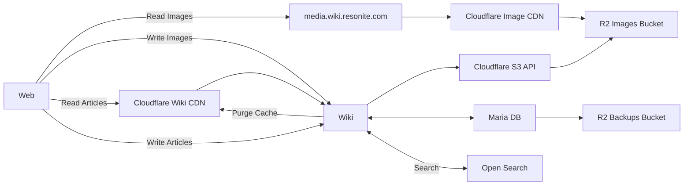

# Resonite Wiki

A collection of files required to spin up the Resonite Wiki using docker compose.

## Goals
1. Open Source 
   - Except for Secrets of Course
2. Fully Documented
3. Avoid Modifying the Containers at runtime.
4. Proper Secret Management
5. Resolving [All public issues involving the wiki](https://github.com/Yellow-Dog-Man/Resonite-Issues/issues?q=state%3Aopen%20label%3A%22Wiki%22)
6. Documented
7. Simple (As possible)

## Context
Our current wiki(wiki.resonite.com) is running an older setup that mixes Docker hosting with extensive editing and tweaking of the Docker container. 

Changes to the docker container at runtime are difficult to manage and can be lost during rebuilding the container etc.

We're rebuilding this setup, to align with the listed goals.

You can read more about this in a bunch of GitHub Issues:
- [Internal Issue](https://github.com/Yellow-Dog-Man/InternalDiscussion/issues/683)
- [All public issues involving the wiki](https://github.com/Yellow-Dog-Man/resonite-wiki/issues?q=is%3Aissue%20state%3Aopen)

Where we lamented about this issue before building this repo to fix it.

## Files
- extensions/
   - Contains all our Mediawiki Extensions. These are Git Submodules
- skins/
   - Contains all our Skins. These are git Submodules
- docker-compose.yaml
   - Compose file that sets everything up
- Dockerfile
   - Contains our custom dockerfile for the mediawiki installation.
   - This can bake Extensions and skins into the docker container, avoiding the overhead and creating a stable image
- config
   - A collection of configuration files for multiple services. 
   - wiki
      - managed and linked into the wiki
      - LocalSettings.php is linked into the container via docker in the usual mechanism.
      - Orchestrated for separation of concerns and maintenance
      - Feel free to re-organize this, the initial split is arbitrary.
- scripts
   - Helpful scripts to handle some automated tasks.

## Images
Images in mediawiki are served over Cloudflare R2 with a CDN.

- Asset Uploads and Management(PUT,PATCH,HEAD etc) use the [AWS Mediawiki extension](https://www.mediawiki.org/wiki/Extension:AWS) to upload to R2
   - Cloudflare R2 has an S3 Compatible API
- Asset Retrieval (GET) for end users, uses Cloudflare's CDN.



## CDN

We use Cloudflare for our CDN. The wiki is routed via CF to improve page load time. 

### Cache Rules

Written out in pseudo-code, can be applied via Cloudflare Dashboard and eventually via API maybe?

#### Cache static assets aggressively
```
When incoming requests match:
  Hostname equals "wiki.resonite.com"
  AND (URI Path starts with "/images/" OR URI Path contains "/load.php")

Then:
  Cache eligibility: Eligible for cache
  Edge Cache TTL: 1 month
```

#### Never cache special/dynamic pages
```
When incoming requests match:
  Hostname equals "your-wiki.com"
  AND (URI Path contains "Special:" OR URI Path contains "api.php")

Then:
  Cache eligibility: Bypass cache
```

#### Cache article pages conservatively
```
When incoming requests match:
  Hostname equals "your-wiki.com"
  AND URI Path starts with "/wiki/"

Then:
  Cache eligibility: Eligible for cache
  Edge Cache TTL: Respect origin
```

## Full CDN Diagram
A full diagram showing CDN routing:



## Cron

Many scheduled or cron related tasks are handled by [ofelia](https://github.com/netresearch/ofelia). Such as:
- The [MediaWiki Job Queue](https://www.mediawiki.org/wiki/Manual:Job_queue)
   - `php /var/www/html/maintenance/run.php runJobs --maxtime=3600`
- automysqlbackup which creates backups
- The RClone Sync process that sends SQL backups to R2. See [#backups](#database-backups)

## Search

Search requires 3 Extensions:
- [Advanced Search](https://www.mediawiki.org/wiki/Extension:AdvancedSearch)
   - Gives the power users the ability to search really well, UI stuff
- [Cirrus Search](https://www.mediawiki.org/wiki/Extension:CirrusSearch)
   - Search infrastructure and search index management
- [Elastica](https://www.mediawiki.org/wiki/Extension:Elastica)
   - Basically an SDK for Elasticsearch

Search via Cirrus, supports ElasticSearch and OpenSearch, we have chosen [OpenSearch](https://opensearch.org/) for now.

### Config

Bare bones, we have no idea what we're doing. PR's welcome.

### Init

Once everything is up and running:

TODO: update cirrus docs on mw docs, it uses old script paths
```
php maintenance/run.php CirrusSearch:UpdateSearchIndexConfig --startOver
php maintenance/run.php CirrusSearch:ForceSearchIndex
php maintenance/run.php CirrusSearch:UpdateSuggesterIndex
```

### Citizen Integration
- TODO: https://starcitizentools.github.io/mediawiki-skins-Citizen/config/#search-suggestions
   - We need to tie our theme into this
- https://starcitizentools.github.io/mediawiki-skins-Citizen/customization/command-palette too 

### Debugging

Run this: `curl resonite-wiki-opensearch:9200/_cat/indices?v`, to check for connectivity and indexes.

# Database

## Seeding

To create a compatible backup from the original wiki:

```bash
mysqldump -h [other-db-host] -u [other-db-user] -p[other-db-password] [other-db-name] | gzip > daily_wiki_db_$(date +%Y%m%d_%H%M%S).sql.gz
```

Manually upload it to the R2_BACKUP_BUCKET_NAME, start the docker stack and the old data will be ingested.

## Public Seeding

We're unable to make the full SQL dump available to the public, it contains backups of user data.

TODO: We can use Data-Dump extensions for .XML downloads of the content, or expose selected table backups.
LONG-TERM-TODO: separate data and account SQL dumps, treat them differently.

## Backups
When the docker compose profile backups is include in startup: `docker compose up --profile backups`:

1. Every day at 12:00AM server time, an automated SQL backup is performed.
   - This creates a tarbell of the database
1. Every day at 01:00AM server time, an automated script runs, which syncs the database backups to Cloudflare R2

The delay between the two operation is to give the SQL backup time to finish. It usually takes a minute or two though.

We use [automysqlbackup](https://github.com/selim13/docker-automysqlbackup) which creates and automatically rotates backups into a folder structure for latest, daily, weekly and monthly backups. 

### Manual Backup Commands
- Make a backup with: `docker exec resonite-wiki-utilities /usr/local/bin/manualBackup.sh`
- Sync the backup to r2 with: `docker exec resonite-wiki-utilities rclone sync /backup r2:wiki-backups/database-backups --transfers 4 --checkers 8 --log-level INFO`

### Environment Variables

The automysqlbackup container uses these environment variables for configuration:

- `DBHOST`: MySQL server hostname (resonite-wiki-database)
- `USERNAME`: MySQL username for backups (root)
- `PASSWORD_FILE`: Path to file containing MySQL root password
- `BACKUPDIR`: Backup directory inside container (/backup)
- `CRON_SCHEDULE`: Cron schedule for automated backups (0 0 * * *)
- `LATEST`: Create latest backup symlink (yes)
- `DBNAMES`: always set this to `wiki_db`

### Bucket Configuration
- Bucket Name: wiki-backups
- Lifecycle policies:
   - Transition to Long Term storage after 5 days
   - Delete after 1 year.

### Backup Syncing
Backup syncing is handled by [RClone](https://rclone.org/). We use the `sync`, command from RClone which will delete and move around files to match the Automysqlbackup folder structure.

## Commands
- `docker compose up` - starts up everything with defaults
- `docker compose up --profile *` - include all profiles
   - recommended to use `runAll.sh`

## TODO
- [x] On First install, restore the most up to date backup of DB
- Backup
   - [X] Take regular automatic backups and send them to R2
- Images
   - [X] Images are now on R2
- [X] [Advanced Search Setup](https://www.mediawiki.org/wiki/Extension:AdvancedSearch)
   - [X] Elastic Search is needed Q.Q
- [X] [Cloudflare setup](https://www.mediawiki.org/wiki/Manual:Cloudflare)
   - Got started here with the R2 images but, need to do more to CDN the rest.
   - [ ] External Stuff
      - [ ] Caddy Setup
      - [ ] CF Rules
      - [ ] Switchover Caddy stuff, "wiki2.resonite.com"
- [X] Requested extensions from GH
- [X] Swap to Ophelia from MWJobrunner and other cronjobs, ophelia is newer. MW Job Runner bulky no need. Ophelia make it better/easier
- [X] Check Extensions list again
- [X] CheckGH issue list once more too
- [X] Swap to https://github.com/netresearch/ofelia
- [X] Test Backup command
   - Ofelia handles this but I haven't actually tested it yet, I must.
- [X] Isolate and minimize Env vars
   - We are currently sharing .env with all containers this gives everyone everything which is bad
- [X] Standardize R2 config, we've got it in two places, look for password file options?
   - Combining the container would be easier.
- [X] Fix composer cache, copy composer.local to installation in docker file before run composer update FASTER

### Immediately After Upgrade
These items require us to isolate Wiki Data to the new wiki rather than continuing to copy across a backup from old to new.
Rather than doing hacky stuff, its easier to wait till we're on new.

- [ ] Fix theming differences
   - [ ] Background Color
   - [ ] Footer
   - [ ] List how you fixed those because you keep forgetting
- [ ] Further group extensions into blocks of similar function
- [ ] Additional Search Improvements
   - [ ] Default to full text search?
   - [ ] /pf, /cmp commands for pf nodes and components
   - [ ] Collapse translation results, En = En
- https://github.com/Yellow-Dog-Man/Resonite-Issues/milestone/5

### After "Upgrade"/Long term Issues

These ones take a bunch more effort, which means they are separate initiatives.
- [ ] PDF
- [ ] Math Rendering fix again
- [ ] Cargo Stuff
- [ ] OAuth!
- https://github.com/Yellow-Dog-Man/Resonite-Issues/milestone/6


## Switchover plan

1. Mark current wiki as read-only.
2. Start up new wiki as wiki2.resonite.com, it will be rw.
3. Collect feedback, prioritize Reading content
4. Shutdown old wiki
5. Rename wiki2 -> wiki

## Resources
- https://www.mediawiki.org/wiki/MediaWiki-Docker
- https://gerrit.wikimedia.org/r/plugins/gitiles/mediawiki/core/+/HEAD/docker-compose.yml
- https://docs.docker.com/compose/how-tos/multiple-compose-files/extends/
- https://hub.docker.com/layers/starcitizentools/mediawiki/smw-jobrunner-latest
- https://github.com/wikimedia/mediawiki-docker?tab=readme-ov-file
- https://github.com/wikimedia/mediawiki-docker/blob/main/1.45/apache/Dockerfile
- https://github.com/selim13/docker-automysqlbackup
- https://hub.docker.com/r/instrumentisto/restic
- https://github.com/openmrs/openmrs-contrib-docker-cron-backup
- https://github.com/robbyoconnor/openmrs-contrib-docker-cron-backup 
   - ofelia is probably better here.
- https://www.compilenrun.com/docs/devops/docker/docker-storage/docker-volume-drivers/#4-azure-file-storage-driver
- https://dev.to/chattes/s3-as-docker-volumes-3bkd + Cloudflare R2
- https://github.com/rexray/rexray
- https://www.mediawiki.org/wiki/Manual:Upgrading
- https://mariadb.com/docs/server/server-management/automated-mariadb-deployment-and-administration/docker-and-mariadb/using-healthcheck-sh
- https://medevel.com/install-mediawiki-using-docker-and-docker-compose/
- https://www.mediawiki.org/wiki/Cli/guide/Docker-Development-Environment/LocalSettings.php
- https://github.com/mcuadros/ofelia
- https://github.com/netresearch/ofelia - Fork with more features
- https://www.mediawiki.org/wiki/Extension:AWS
- https://www.mediawiki.org/wiki/Manual:$wgLocalFileRepo
- https://www.mediawiki.org/wiki/Manual:$wgFileBackends
- https://www.mediawiki.org/wiki/Manual:$wgLockManagers
- https://www.mediawiki.org/wiki/Extension:CirrusSearch
- https://www.mediawiki.org/wiki/Extension:AdvancedSearch
- https://starcitizentools.github.io/mediawiki-skins-Citizen/config/#search-suggestions
- https://docs.opensearch.org/latest/install-and-configure/install-opensearch/docker/
- https://gerrit.wikimedia.org/g/mediawiki/extensions/CirrusSearch/%2B/HEAD/README
- https://github.com/netresearch/ofelia?tab=readme-ov-file#example-compose-setup
- https://rclone.org/docs/#environment-variables

### Composer Stuff
Some useful composer commands, used to find dependencies within extensions/skins.
- `grep -r "composer/installers.*1\.\*,>=1.0.1" extensions/*/composer.json skins/*/composer.json`
- `grep -r "johnkary/phpunit-speedtrap" extensions/*/composer.json skins/*/composer.json`
- `grep -r "firebase/php-jwt.*5\.2" extensions/*/composer.json skins/*/composer.json`

## Logs
- `docker compose logs -f --tail=20`

### Run maintenance via docker

- `docker exec resonite-wiki php /var/www/html/maintenance/run.php namespaceDupes --fix`
- `docker exec resonite-wiki php /var/www/html/maintenance/run.php rebuildLocalisationCache`
   - You have to do this one like regularly >.<
- `docker exec resonite-wiki php /var/www/html/maintenance/run.php update`

### Drop Down styling

https://github.com/StarCitizenTools/mediawiki-skins-Citizen/blob/main/resources/skins.citizen.scripts/dropdown.js

## Mediawiki Log Settings

Do not enable these unless there is a problem, they make a lot of noise.
```php
// Slow DB
$wgDebugDumpSql = true;
$wgDebugLogGroups['DBQuery'] = "/var/log/mediawiki/db-queries.log";
$wgDebugLogGroups['slow-queries'] = "/var/log/mediawiki/slow-queries.log";

// Log requests
$wgDebugLogGroups['request'] = "/var/log/mediawiki/requests.log";

//Cache/session issues:
$wgDebugLogGroups['ObjectCache'] = "/var/log/mediawiki/cache.log";
$wgDebugLogGroups['SessionManager'] = "/var/log/mediawiki/session.log";

// If users are having login/permission problems
$wgDebugLogGroups['authentication'] = "/var/log/mediawiki/auth.log";

// Verbose debugging - generates LOTS of output
$wgDebugLogFile = "/var/log/mediawiki/debug.log";
```
