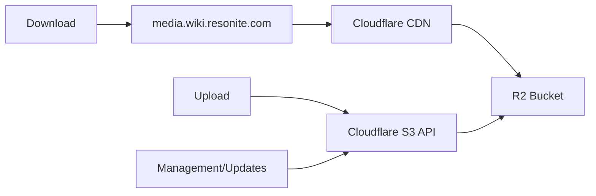

# Resonite Wiki

A collection of files required to spin up the Resonite Wiki. 

> WIP Right now. Feel free to observe, but let me cook - prime.

## Goals
1. Open Source 
   - Except for Secrets of Course
2. Fully Documented
3. Avoid Modifying the Containers at runtime.
4. Proper Secret Management
5. Resolving [All public issues involving the wiki](https://github.com/Yellow-Dog-Man/Resonite-Issues/issues?q=state%3Aopen%20label%3A%22Wiki%22)


## Context
Our current wiki(wiki.resonite.com) is running an older setup that mixes Docker hosting with extensive editing and tweaking of the Docker container. As changes to docker containers at runtime are difficult to persist and prevent operations like rebuilding a container etc. this old setup is being replaced with the contents of this repository.

You can read more about this in a bunch of GitHub Issues:
- [Internal Issue](https://github.com/Yellow-Dog-Man/InternalDiscussion/issues/683)
- [All public issues involving the wiki](https://github.com/Yellow-Dog-Man/Resonite-Issues/issues?q=state%3Aopen%20label%3A%22Wiki%22)

## Files
- extensions/
   - Contains all our Mediawiki Extensions. These are Git Submodules
- skins/
   - Contains all our Skins. These are git Submodules
- docker-compose.yaml
   - Compose file that sets everything up
- Dockerfile
   - Contains our custom dockerfile for the mediawiki installation.
   - This can bake Extensions and skins into the docker container, avoiding the overhead and creating a stable image
- config
   - A collection of configuration files, managed and linked into the container
   - LocalSettings.php is linked into the container via docker in the usual mechanism.
   - Orchestrated for separation of concerns and maintenance
   - Feel free to re-organize this, the initial split is arbitrary.
- scripts
   - Helpful scripts to handle some automated tasks.

## Images
Images in mediawiki are served over Cloudflare R2 with a CDN.

- Asset Uploads and Management(PUT,PATCH,HEAD etc) use the [AWS Mediawiki extension](https://www.mediawiki.org/wiki/Extension:AWS) to upload to R2
   - Cloudflare R2 has an S3 Compatible API
- Asset Retrieval (GET) for endusers, uses Cloudflare's CDN.



## Cron

Many scheduled or cron related tasks are handled by [ofelia](https://github.com/mcuadros/ofelia). Such as:
- The [MediaWiki Job Queue](https://www.mediawiki.org/wiki/Manual:Job_queue)
- The RClone Sync process that sends SQL backups to R2. See [#backups](#database-backups)

## Search

Search requires 3 Extensions:
- [Advanced Search](https://www.mediawiki.org/wiki/Extension:AdvancedSearch)
   - Gives the power users the ability to search really well, UI stuff
- [Cirrus Search](https://www.mediawiki.org/wiki/Extension:CirrusSearch)
   - Search infrastructure and search index management
- [Elastica](https://www.mediawiki.org/wiki/Extension:Elastica)
   - Basically an SDK for Elasticsearch

Search via Cirrus, supports ElasticSearch and OpenSearch, we have chosen [OpenSearch](https://opensearch.org/) for now.

As this is a docker setup, it is fairly easy to swap between them by editing container images. When doing this ensure you check for compatibility.

- TODO: https://starcitizentools.github.io/mediawiki-skins-Citizen/config/#search-suggestions
   - We need to tie our theme into this 

# Database

## Seeding

To create a compatible backup from the original wiki:

```bash
mysqldump -h [other-db-host] -u [other-db-user] -p[other-db-password] [other-db-name] | gzip > daily_wiki_db_$(date +%Y%m%d_%H%M%S).sql.gz
```

Manually upload it to the R2_BACKUP_BUCKET_NAME, start the docker stack and the old data will be ingested.

## Backups
When the docker compose profile backups is include in startup: `docker compose up --profile backups`:

1. Every day at 12:00AM server time, an automated MySQL backup is performed.
   - This creates a tarbell of the database
1. Every day at 01:00AM server time, an automated script runs, which syncs the database backups to Cloudflare R2

### Bucket Configuration
- Bucket Name: wiki-backups
- Lifecycle policies:
   - Transition to Long Term storage after 5 days
   - Delete after 1 year.

# Commands
- `docker compose up` - starts up everything with defaults
- `docker compose up --profile backups`

# TODO
- [ ] On First install, restore the most up to date backup of DB
- Images
   - [X] Images are now on R2
   - [ ] Non R2 Backup, could just allow a Download of a tar.gz
      - Do we need to backup R2?
- [ ] [Advanced Search Setup](https://www.mediawiki.org/wiki/Extension:AdvancedSearch)
   - [ ] Elastic Search is needed Q.Q
- [ ] [Cloudflare setup](https://www.mediawiki.org/wiki/Manual:Cloudflare)
   - Got started here with the R2 images but, need to do more to CDN the rest.
- [ ] Requested extensions from GH
- [ ] Swap to Ophelia from MWJobrunner and other cronjobs, ophelia is newer. MW Job Runner bulky no need. Ophelia make it better/easier
- [ ] Further group extensions into blocks of similar function

### During Upgrade Issues
- https://github.com/Yellow-Dog-Man/Resonite-Issues/milestone/5

### After "Upgrade" Issues
- [ ] PDF
- [ ] Math Rendering fix again
- [ ] Cargo Stuff
- [ ] OAuth!
- https://github.com/Yellow-Dog-Man/Resonite-Issues/milestone/6

## Resources
- https://www.mediawiki.org/wiki/MediaWiki-Docker
- https://gerrit.wikimedia.org/r/plugins/gitiles/mediawiki/core/+/HEAD/docker-compose.yml
- https://docs.docker.com/compose/how-tos/multiple-compose-files/extends/
- https://hub.docker.com/layers/starcitizentools/mediawiki/smw-jobrunner-latest
- https://github.com/wikimedia/mediawiki-docker?tab=readme-ov-file
- https://github.com/wikimedia/mediawiki-docker/blob/main/1.45/apache/Dockerfile
- https://github.com/selim13/docker-automysqlbackup
- https://hub.docker.com/r/instrumentisto/restic
- https://github.com/openmrs/openmrs-contrib-docker-cron-backup
- https://github.com/robbyoconnor/openmrs-contrib-docker-cron-backup 
   - ofelia is probably better here.
- https://www.compilenrun.com/docs/devops/docker/docker-storage/docker-volume-drivers/#4-azure-file-storage-driver
- https://dev.to/chattes/s3-as-docker-volumes-3bkd + Cloudflare R2
- https://github.com/rexray/rexray
- https://www.mediawiki.org/wiki/Manual:Upgrading
- https://mariadb.com/docs/server/server-management/automated-mariadb-deployment-and-administration/docker-and-mariadb/using-healthcheck-sh
- https://medevel.com/install-mediawiki-using-docker-and-docker-compose/
- https://www.mediawiki.org/wiki/Cli/guide/Docker-Development-Environment/LocalSettings.php
- https://github.com/mcuadros/ofelia
- https://www.mediawiki.org/wiki/Extension:AWS
- https://www.mediawiki.org/wiki/Manual:$wgLocalFileRepo
- https://www.mediawiki.org/wiki/Manual:$wgFileBackends
- https://www.mediawiki.org/wiki/Manual:$wgLockManagers
- https://www.mediawiki.org/wiki/Extension:CirrusSearch
- https://www.mediawiki.org/wiki/Extension:AdvancedSearch
- https://starcitizentools.github.io/mediawiki-skins-Citizen/config/#search-suggestions

### Composer Stuff
Some useful composer commands, used to find dependencies within extensions/skins.
- `grep -r "composer/installers.*1\.\*,>=1.0.1" extensions/*/composer.json skins/*/composer.json`
- `grep -r "firebase/php-jwt.*5\.2" extensions/*/composer.json skins/*/composer.json`